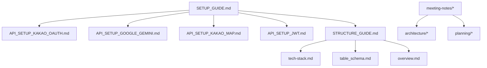

# **반띵(Banthing) 프로젝트 구조 정의서**

본 문서는 반띵(Banthing) 프로젝트의 전체 디렉토리 구조와 각 폴더 및 주요 파일의 역할을 설명합니다.  
프로젝트는 백엔드와 프론트엔드가 분리된 구조를 따르며, 별도 레포지토리에서 문서를 관리하는 체계적인 구조를 지향합니다.

## 문서 정보
- **문서명**: 반띵 프로젝트 구조 정의서
- **버전**: v1.1.0
- **작성일**: 2025.09.22
- **작성자**: 김경민
- **최종 수정일**: 2025.09.22

**대상 독자:**
- **백엔드/프론트엔드 개발자**: 프로젝트 구조 및 모듈 의존성 이해
- **QA/테스터**: 테스트 경로 및 코드 구조 파악
- **신규 합류자**: 빠른 온보딩을 위해 전체 구조 학습
- **운영자/PM**: 코드와 문서 관리 체계 확인

---

## **1. 프로젝트 전체 구조**

```
banthing/
├── backend/                    # 백엔드 (Spring Boot)
├── frontend/                   # 프론트엔드 (React + Vite)
└── README.md                   # 프로젝트 메인 설명서

banthing-docs/
├── guides/                     # 설정 및 사용 가이드
├── architecture/               # 아키텍처 문서 (DB, API, ERD)
├── tech/                       # 기술 스택 명세서
├── planning/                   # 기획 및 설계 문서
├── meeting-notes/              # 회의록 
├── trouble-shooting/           # 개인별 트러블슈팅 기록
├── assets/                     # 문서용 이미지 및 자산
└── README.md                   # 문서 레포지토리 소개
```

> 📁 **별도 레포지토리**: 문서(docs)는 별도 레포지토리에서 관리  
> 🔗 **문서 레포지토리**: [BanThing-docs](https://github.com/Nonagajyeo/BanThing-docs) 참조
> 🔗 **개발 레포지토리**: [BanThing-dev](https://github.com/Nonagajyeo/BanThing-dev) 참조

---

## **2. 백엔드 구조 (`backend/`)**

Spring Boot 3.5.5 기반의 Java 애플리케이션으로 구성됩니다.

```
backend/
├── .env                        # 환경변수 (Git 제외)
├── .env.example                # 환경변수 예시
├── build.gradle                # Gradle 빌드 설정
├── gradlew                     # Gradle Wrapper (Unix)
├── gradlew.bat                 # Gradle Wrapper (Windows)
├── settings.gradle             # Gradle 프로젝트 설정
└── src/
    ├── main/
    │   ├── java/com/nathing/banthing/
    │   │   ├── config/         # 설정 클래스들
    │   │   │   ├── ChatbotConfig.java
    │   │   │   ├── SecurityConfig.java
    │   │   │   ├── JwtAuthenticationFilter.java
    │   │   │   └── OAuth2SuccessHandler.java
    │   │   ├── controller/     # REST API 컨트롤러
    │   │   │   ├── ChatbotController.java
    │   │   │   ├── MeetingController.java
    │   │   │   └── UserController.java
    │   │   ├── dto/            # 데이터 전송 객체
    │   │   │   ├── request/    # 요청 DTO
    │   │   │   └── response/   # 응답 DTO
    │   │   ├── entity/         # JPA 엔티티
    │   │   │   ├── User.java
    │   │   │   ├── Meeting.java
    │   │   │   ├── Mart.java
    │   │   │   └── ChatbotConversation.java
    │   │   ├── exception/      # 예외 처리
    │   │   │   ├── BusinessException.java
    │   │   │   ├── ErrorCode.java
    │   │   │   └── GlobalExceptionHandler.java
    │   │   ├── repository/     # 데이터 접근 계층
    │   │   │   ├── UsersRepository.java
    │   │   │   ├── MeetingsRepository.java
    │   │   │   └── impl/       # 커스텀 구현체
    │   │   ├── service/        # 비즈니스 로직
    │   │   │   ├── ChatbotService.java
    │   │   │   ├── MeetingService.java
    │   │   │   └── UserService.java
    │   │   ├── util/           # 유틸리티 클래스
    │   │   └── BanthingApplication.java
    │   └── resources/
    │       ├── application.yml # Spring Boot 설정
    │       ├── data.sql        # 더미 데이터
    │       └── static/         # 정적 리소스
    └── test/                   # 테스트 코드
        └── java/com/nathing/banthing/
```

### **2-1. 주요 디렉토리 설명**

| 디렉토리 | 역할 | 주요 파일 |
|----------|------|-----------|
| **config** | Spring 설정 및 보안 설정 | ChatbotConfig, SecurityConfig, JWT 관련 |
| **controller** | REST API 엔드포인트 | 각 도메인별 컨트롤러 |
| **dto** | 데이터 전송 객체 | request/response DTO 분리 |
| **entity** | JPA 엔티티 클래스 | 데이터베이스 테이블 매핑 |
| **repository** | 데이터 접근 계층 | Spring Data JPA 인터페이스 |
| **service** | 비즈니스 로직 처리 | 핵심 서비스 로직 |

---

## **3. 프론트엔드 구조 (`frontend/`)**

React 19.1.1 + Vite 기반의 SPA(Single Page Application)로 구성됩니다.

```
frontend/
├── .env                        # 환경변수 (Git 제외)
├── .env.example                # 환경변수 예시
├── package.json                # npm 패키지 설정
├── package-lock.json           # 패키지 버전 잠금
├── vite.config.js              # Vite 빌드 설정
├── index.html                  # HTML 진입점
├── public/                     # 정적 파일
│   └── vite.svg
└── src/
    ├── main.jsx                # React 앱 진입점
    ├── App.jsx                 # 메인 App 컴포넌트
    ├── index.css               # 전역 스타일
    ├── components/             # 재사용 가능한 컴포넌트
    │   ├── common/             # 공통 컴포넌트
    │   ├── chatbot/            # 챗봇 관련 컴포넌트
    │   ├── meeting/            # 모임 관련 컴포넌트
    │   └── user/               # 사용자 관련 컴포넌트
    ├── pages/                  # 페이지 컴포넌트
    │   ├── HomePage.jsx
    │   ├── MeetingDetailPage.jsx
    │   ├── ChatbotPage.jsx
    │   └── LoginPage.jsx
    ├── hooks/                  # 커스텀 훅
    ├── utils/                  # 유틸리티 함수
    ├── store/                  # Zustand 상태 관리
    │   └── authStore.js
    ├── api/                    # API 통신 관련
    │   └── apiClient.js        # Axios 인스턴스
    └── assets/                 # 이미지, 아이콘 등
```

### **3-1. 주요 디렉토리 설명**

| 디렉토리 | 역할 | 주요 파일 |
|----------|------|-----------|
| **components** | 재사용 가능한 UI 컴포넌트 | 도메인별 컴포넌트 분리 |
| **pages** | 라우팅되는 페이지 컴포넌트 | 각 화면별 페이지 |
| **store** | Zustand 전역 상태 관리 | 인증, 사용자 정보 등 |
| **api** | 백엔드 API 통신 | Axios 설정 및 API 함수 |
| **hooks** | 커스텀 React 훅 | 재사용 가능한 로직 |

---

## **4. 환경 설정**

### **4-1. 백엔드 환경변수 (`.env`)**
```bash
# 서버 설정
SERVER_PORT=9000

# JWT 설정
JWT_SECRET=your_jwt_secret_key
JWT_ACCESS_TOKEN_EXPIRATION=900000
JWT_REFRESH_TOKEN_EXPIRATION=604800000

# OAuth2 설정
KAKAO_CLIENT_ID=your_kakao_client_id
KAKAO_CLIENT_SECRET=your_kakao_client_secret

# Google Gemini API
GOOGLE_AI_API_KEY=your_google_ai_api_key
GOOGLE_AI_MODEL=gemini-1.5-flash

# 파일 업로드
FILE_UPLOAD_PATH=C:/banthing_uploads/
```

### **4-2. 프론트엔드 환경변수 (`.env`)**
```bash
# API 서버 URL
VITE_API_URL=http://localhost:9000/api

# 카카오 맵 API
VITE_KAKAO_APP_KEY=your_kakao_map_key

# 챗봇 설정
VITE_CHATBOT_ENABLED=true
VITE_CHATBOT_LOAD_HISTORY=true
```
> 자세한 설명은 다음 문서를 참조하세요:
- **[프로젝트 클론 및 환경설정 가이드](SETUP_GUIDE.md)**

---

## **5. 개발 워크플로우**

### **5-1. 개발 환경 실행**
```bash
# 백엔드 실행
cd backend
./gradlew bootRun

# 프론트엔드 실행 (새 터미널)
cd frontend
npm run dev
```

### **5-2. 빌드 및 배포**
```bash
# 백엔드 빌드
cd backend
./gradlew build

# 프론트엔드 빌드
cd frontend
npm run build
```
> 자세한 설명은 다음 문서를 참조하세요:
- **[프로젝트 클론 및 환경설정 가이드](SETUP_GUIDE.md)**

---

## **6. 데이터베이스 구조**

### **6-1. 주요 테이블**
- **marts**: 마트 지점 정보 (지도 API 연동)
- **users**: 사용자 정보 (카카오 OAuth)
- **meetings**: 모임 정보
- **meeting_participants**: 모임 참여자
- **chatbot_conversations**: 챗봇 대화 이력
- **feedbacks**: 사용자 간 피드백

> 자세한 스키마는 다음 문서를 참조하세요: 
- **[반띵 데이터베이스 테이블 스키마](../architecture/table_schema.md)**

---

## **7. 기술 스택**

### **7-1. 백엔드**
- **Framework**: Spring Boot 3.5.5
- **Security**: Spring Security + JWT
- **Database**: MariaDB 11.4.x, Spring Data JPA
- **AI**: Google Gemini API
- **Build**: Gradle

### **7-2. 프론트엔드**
- **Framework**: React 19.1.1
- **Build Tool**: Vite
- **State Management**: Zustand 5.0.8
- **HTTP Client**: Axios
- **UI**: React Icons, Tailwind CSS 대체 유틸리티

### **7-3. 개발 도구**
- **IDE**: IntelliJ IDEA Ultimate, VS Code
- **VCS**: Git, GitHub
- **Communication**: Discord

> 자세한 설명은 다음 문서를 참조하세요:
- **[기술 스택 명세서](../tech/tech-stack.md)**

---

## **8. 문서 관리**

### **8-1. 별도 문서 레포지토리**
프로젝트 문서들이 별도 레포지토리에서 관리되는 전체 구조를 보여줍니다.
```
banthing-docs/
├── README.md                           # 문서 레포지토리 소개
├── .gitignore                          # Git 제외 파일 설정
├── guides/                             # 설정 및 사용 가이드
│   ├── SETUP_GUIDE.md                  # 프로젝트 클론 및 환경설정 가이드
│   ├── STRUCTURE_GUIDE.md              # 프로젝트 구조 정의서
│   ├── API_SETUP_KAKAO_OAUTH.md        # 카카오 OAuth 설정 가이드
│   ├── API_SETUP_GOOGLE_GEMINI.md      # Google Gemini API 설정 가이드
│   ├── API_SETUP_KAKAO_MAP.md          # 카카오 맵 API 설정 가이드
│   └── API_SETUP_JWT.md                # JWT 토큰 설정 가이드
├── architecture/                       # 아키텍처 문서
│   ├── table_schema.md                 # 데이터베이스 스키마
│   ├── Logical_ERD.md                  # ERD 명세서
│   └── api_*.md                        # API 명세서
├── tech/                               # 기술 관련 문서
│   └── tech-stack.md                   # 기술 스택 명세서
├── planning/                           # 기획 및 설계 문서
│   ├── overview.md                     # 프로젝트 개요
│   ├── wireframe.md                    # 와이어프레임
│   └── prd_.md                         # 사용자 스토리
├── meeting-notes/                      # 회의록
├── trouble-shooting/                   # 트러블슈팅 기록
│   ├── template.md                      
│   ├── minee0505/                      # 김경민 개인 트러블슈팅
│   │   └── .gitkeep
│   ├── Kanggwanju/                     # 강관주 개인 트러블슈팅
│   │   └── .gitkeep
│   ├── rhehdgus8831/                   # 고동현 개인 트러블슈팅
│   │   └── .gitkeep
│   ├── songkey06/                      # 송민재 개인 트러블슈팅
│   │   └── .gitkeep
│   └── hsp64/                          # 박현수 개인 트러블슈팅
│       └── .gitkeep
└── assets/                             # 문서용 자산
└── img/                            # 이미지 파일
└── erd/                        # ERD 이미지
└── .gitkeep
```

### **8-2. 문서 연결성**

#### **상호 참조 구조**


#### **문서 업데이트 플로우**
1. **기능 변경 시**: `architecture/` → `guides/` 순서로 업데이트
2. **새 기술 도입 시**: `tech/tech-stack.md` → 관련 가이드 업데이트
3. **API 변경 시**: `architecture/api_specification.md` → 관련 설정 가이드 업데이트

### **8-3. 문서 관리 원칙**

#### **버전 관리**
- 모든 문서에 버전 정보 및 변경 이력 포함
- 주요 변경 시 버전 업데이트 (v1.0 → v1.1)

#### **작성 규칙**
- 문서 정보 헤더 필수 포함
- 대상 독자 명시
- 상호 참조 링크 활용

#### **품질 관리**
- 신규 문서 작성 시 템플릿 활용
- 정기적인 문서 검토 및 업데이트
- 팀원 간 문서 리뷰 프로세스

---

> 본 구조를 참고하여 효율적인 개발과 유지보수를 진행해주세요.

## 변경 이력

| 버전     | 날짜         | 변경 내용                                  | 작성자 |
|--------|------------|----------------------------------------|-----|
| v1.0.0 | 2025.09.12 | 초기 문서 작성                               | 김경민 |
| v1.1.0 | 2025.09.22 | 실제 프로젝트 구조 반영, backend/frontend 분리 구조 업데이트 | 김경민 |