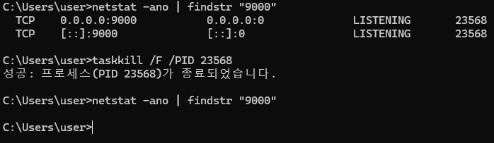

## 📅 발생 일자
- 2025-09-22

---

## 🧩 문제 상황
- 로컬 개발 환경에서 백엔드(port:9000) 또는 프론트엔드(port:5173)를 실행할 때,
  "Address already in use" 에러가 발생하며 서버가 실행되지 않았습니다.

---

## 🔍 원인 분석
- 다른 프로세스가 이미 해당 포트를 사용 중이었습니다. 이전에 실행했던 서버 프로세스가 정상적으로 종료되지 않았거나,
  다른 애플리케이션이 해당 포트를 점유하고 있었기 때문입니다.

---

## 🛠 해결 방법
- 해당 포트를 사용 중인 프로세스(PID)를 찾아 강제 종료하여 문제를 해결했습니다.
- **포트 번호로 PID 찾기:**
    - `netstat -ano | findstr "9000"`
    - `netstat -ano | findstr "5173"`
    - 해당 명령어를 실행하면 마지막 열에 PID가 표시됩니다.

- **PID를 사용하여 프로세스 강제 종료:**
    - `taskkill /F /PID <PID 번호>`
    - 예: `taskkill /F /PID 1234`
    - 

(사용 예시)
---

## ✅ 결과
- 위 해결 방법을 통해 해당 포트의 점유를 해제한 후, 백엔드 및 프론트엔드 서버가 정상적으로 실행되는 것을 확인했습니다.

---

## 📚 교훈 / 예방책
- 서버를 종료할 때 `Ctrl + C`와 같은 정상적인 방법으로 종료하는 습관을 들이고, 비정상적으로 종료된 경우 포트 점유 상태를 확인하고
  필요시 프로세스를 강제로 종료하는 방법을 숙지합니다.
- 향후 스크립트나 자동화 도구를 활용하여 개발 시작 전 사용 중인 포트를 자동으로 확인하고 해제하는 방안을 고려할 수 있습니다.